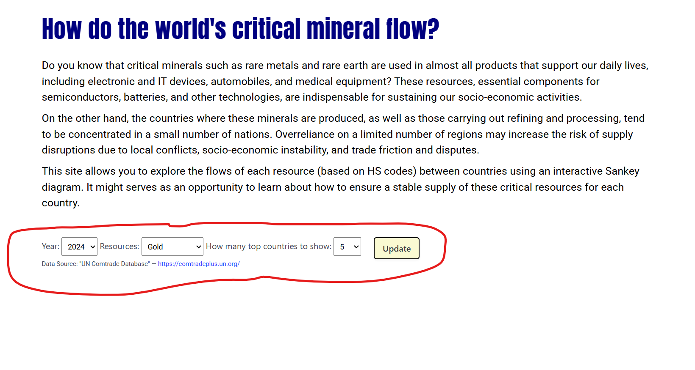
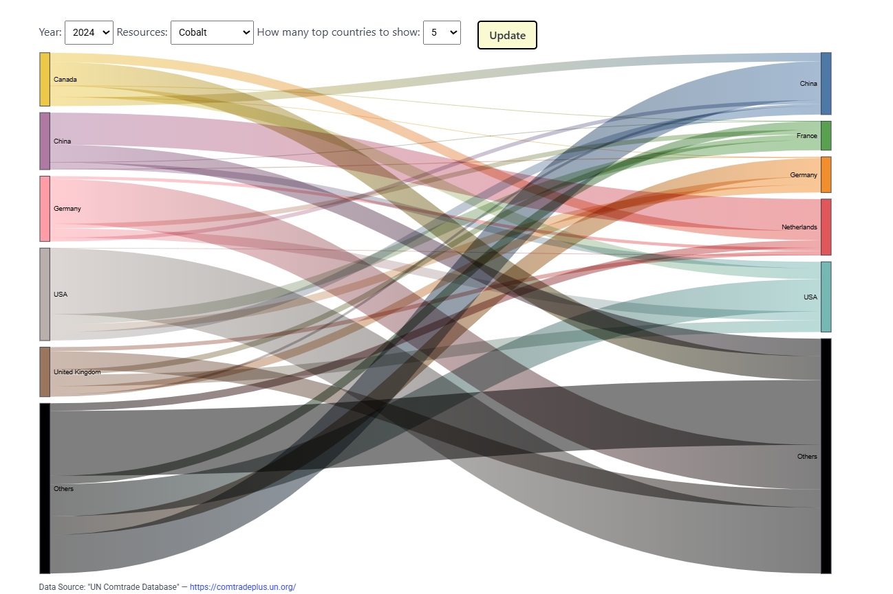

# Sankey Chart of critical minerals trade flow

Ryota Shimizu

## Goal

My goal is to create a Sankey diagram showing the flows of mineral resources, such as silver, platinum, and rare earth elements, between countries using international trade data. The diagram is interactive, allowing users to choose any metal resource, year, and the number of countries to display in total. I also plan to allow them to select additional countries of interest, enabling them to grasp the full picture of mineral resource flows and analyze them in depth. This will help research the ubiquity and sources of supply of important resources, which are fundamental to our economy and society.

## Data Challenges

I'm currently working with real data from UN Comtrade. At the moment, I am using only three years of data fetched through the API, because re-dissemination of over 100,000 records without permission is not allowed except for internal use. Although I'm not sure whether this project counts as non-internal re-dissemination, so far I am using fewer than 60,000 records.

## Walk Through

Users can select Year, Metal Resources, the number of countries to show from each pulldown as below.
 
As they press Update button, Sankey graph will show up immediately like this picture.

Also I plan to add function that users can choose any countries they want.

## Questions

{Numbered list of questions for course staff, if any.}

1. Should I add some stylish effects, like animation?
2. 
3. 