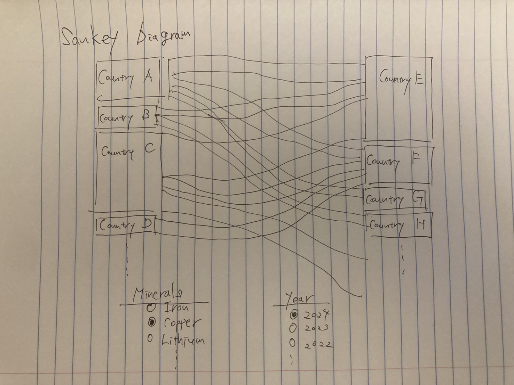
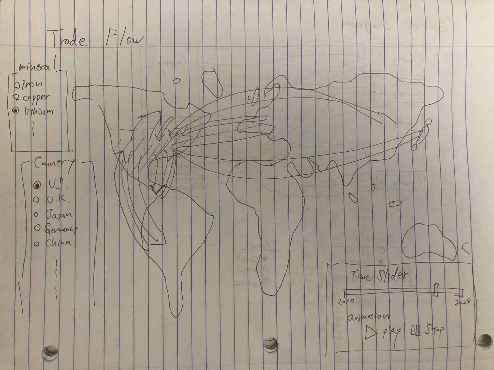

# Ryota Shimizu

## Description

I plan to use international trade data to create an interactive graph and map that reveal the flows of mineral resources, such as iron, copper, and rare earth elements—between countries, by product and year. This will help analyze the ubiquity and sources of supply of important resources, which are fundamental to our economy and society.

## Technical Plan re: Option A/B/C/D

Option A

At first, I plan to create a Sankey diagram showing the flows of specific minerals by country using Altair and D3. In this graph, users can select a mineral resource and a year, and then the Sankey diagram for that material will be displayed. This allows people to grasp the whole picture of international mineral resource flows at a glance.

Second, I plan to create a trade flow map in which arrows, whose widths correspond to trade values, are drawn from countries to other countries on the world map. Users will be able to select any country, after which all arrows to and from the selected country will be displayed. Additionally, there will be a time frame slider, allowing users to view a decade-long trend of trade flows by moving the slider or playing an animation.

## Mockup
Sankey diagram
  

Trade flow map

## Data Sources

World Integrated Trade Solution

### Data Source 1: World Integrated Trade Solution

URL: https://wits.worldbank.org/trade/country-byhs6product.aspx?lang=en
API overview: https://wits.worldbank.org/witsapiintro.aspx?lang=en

Size: 2000000 rows, 9 columns

This dataset includes Reporter country, Expot or Import, Product code(HS code), Year, Partner country, Trade value, Quantity and Quantity unit. I can get all transaction data to make both graphs. However, I cannot get whole bulk data for free, so I plan to send a multiple API request and save them as json files.

## Questions

{Numbered list of questions for course staff, if any.}

1. I plan to fetch trade data through multiple API calls since I can't download a whole bulk data for free. In each request, one of the trading countries, the year, and the product must be specified. Therefore, I would need to send 200 (reporter countries) × 10–20 (products) × 10–15 (years) = 20,000–60,000 calls. Although it may be possible to reduce the number by focusing only on countries that actually traded in a given year, it still requires a massive number of calls. Is this feasible, or is there a more efficient approach?

2. If I gather all the data into a single file, it would contain over one million rows. Is that too much?

3. At first, I thought I would create a simulation model that shows what would happen if a certain percentage of a specific trade flow decreases (e.g., iron from country A to B decreases by 50%) using an instant network model. However, I realized this approach would be too complex and I did not have a clear idea for how to visualize it—I had imagined animations in which circles representing one unit of increasing or decreasing trade values (e.g., $1 million) move from one country to another on a world map. Thus, I plan to give up at this point, but would you have any ideas for building such a model and its visualization?